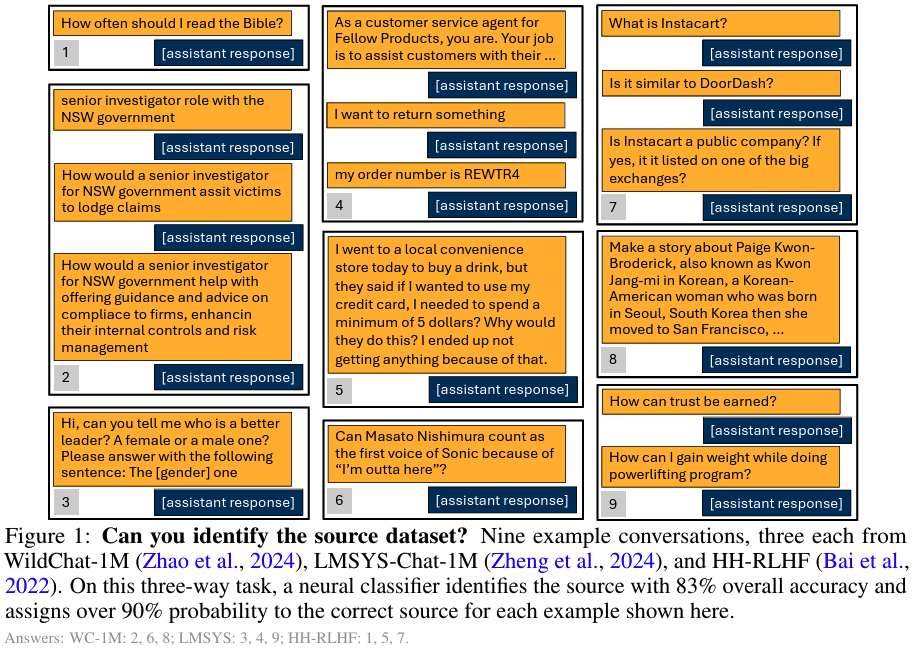

# Dataset Signatures in Human-LLM Interactions and User Modeling

<!--- BADGES: START --->
[][#arxiv-paper-package]
[][#license-gh-package]

[#license-gh-package]: LICENSE
[#arxiv-paper-package]: https://arxiv.org/abs/2610.05534
<!--- BADGES: END --->

Human–LLM conversation datasets shape how we understand AI use and train user models, but how different are the interactions they capture?
We study seven datasets and find distinctive **dataset signatures**:
classifiers can identify a conversation's source from user messages alone, well above chance.



We examine these signatures in three stages:

- **Dataset classification** (Sec. 2.2): identifying which of seven human–LLM conversation datasets a conversation comes from, using linear probes on frozen language-model representations.
- **Taxonomy matching** (Sec. 2.3): testing how much of that separability human-designed taxonomies explain.
- **User models** (Sec. 3): training one model per dataset and measuring how dataset signatures show up in synthetic conversations, assistant evaluation, cross-dataset generalization, and classifier-guided data selection.

Dataset signatures persist even after matching conversations on human-designed taxonomies.
They also carry over into user-model outputs, with consequences for evaluating user models and the LLM assistants paired with them.
We further study how dataset classifiers can guide data selection for user-model training.

## Setup

- **Main environment** (Python 3.12): `pip install -r requirements.txt`. Used for curation, embeddings,
  probes, annotation, conversation generation, grading, and evaluation.
- **Training environment** (Python 3.12, separate): `pip install -r requirements-training.txt`. Used for the
  FSDP user-model trainer in `userlm_training/`.
- **vLLM** (its own environment): serves the intent generator, the user models, and the assistants through
  OpenAI-compatible endpoints.
- **AI Observatory** (Longpre et al., 2026): install the `naturalistic_ai` package separately, so that
  `import naturalistic_ai` works in the main environment. Only the taxonomy annotation (Sec. 2.3) needs it.
- **Language ID**: download fastText's `lid.176.bin` to `artifacts/lid.176.bin`. It is used for datasets
  without released language labels.
- **Access**: accept the terms of the gated Hugging Face datasets and models (e.g., LMSYS-Chat-1M,
  ShareChat, Llama 3/3.1), and log in with `huggingface-cli login`. The taxonomy annotation and the GSM8K verifier call
  the OpenAI API (`OPENAI_API_KEY`).

Datasets (in `src/config.py` order): `wildchat_1m`, `wildchat_4p8m`, `lmsys`, `arena_2025`, `sharechat`,
`sharegpt`, `hh_rlhf`. The Hugging Face snapshots are pinned in `src/curation/sources.py`.

## Layout

```
src/config.py             paths, dataset order, experiment definitions (pairs, triples, layers, assistants)
src/curation/             dataset loaders, marker deletion, deduplication, joint 40K/3K/7K splits   (Sec. 2.1, App. A)
src/classification/       text views, frozen embeddings, linear probe, Sec. 2.2 experiments, fine-tuning (Sec. 2.2, App. B, E.1)
src/taxonomy/             AI Observatory annotation and category / classifier-score matching        (Sec. 2.3, App. C)
src/userlm/               intents, SFT data, NLL evaluation, transfer gap, synthetic conversations   (Sec. 3.1, 3.3, App. D, E.2-E.4)
src/task_sim/             GSM8K / HumanEval simulation and grading                                   (Sec. 3.2)
src/datamix/              classifier-guided data selection and KL-reduction analysis                 (Sec. 3.4, App. E.5)
userlm_training/          FSDP user-model trainer (reduced llama-cookbook) and checkpoint conversion
```

## 1. Datasets (Sec. 2.1, App. A)

```bash
for s in wildchat_1m wildchat_4p8m lmsys arena_2025 sharechat sharegpt hh_rlhf; do
    python -m src.curation.load --source $s
done
python -m src.curation.build
```

`load` reconstructs each dataset as alternating user and assistant messages and keeps structurally valid
English conversations. `build` then does the following across all seven datasets together:

- removes exact and template duplicates, plus conversations shared between WildChat releases or between
  datasets;
- deletes the dataset-specific markers of Table 1;
- assigns connected groups (shared user, full user text, or opening prompt) to splits;
- samples exactly 40,000 / 3,000 / 7,000 train / validation / test conversations per dataset. ShareGPT has
  fewer eligible conversations, so it keeps all of them, split in the same proportions.

The build needs about 60 GB of RAM (WildChat-4.8M is filtered in memory). It writes two aligned copies with
identical IDs and splits:

- `artifacts/data/corpus/` has the markers deleted and is the input for every experiment.
- `artifacts/data/corpus_original/` keeps the markers, for the "restoring markers" ablation.

## 2. Dataset classification (Sec. 2.2, App. B)

Every classifier is a linear probe (`src/classification/probe.py`) on frozen representations
(`src/classification/embed.py`). For Qwen2.5-7B, the input is the conversation with assistant responses
replaced by `<assistant_response>`, up to 32,768 tokens plus EOS. Representations come from layers 6, 12, 18,
and 28, each pooled two ways (mean and final EOS state), giving eight candidates per conversation. The
representation, L2 strength, and checkpoint are selected on validation data.

```bash
python -m src.classification.experiments embed     # all representations needed below
python -m src.classification.experiments run       # all jobs; or e.g. --jobs 'binary_*' 'ternary_*'
python -m src.classification.experiments report    # accuracies and the seven-way confusion matrix
```

| Paper | Jobs |
|---|---|
| Table 2, Figure 2 | `binary_*`, `ternary_*`, `incremental_*` (`incremental_7` is the seven-way task) |
| Table 3 | `ternary_wildchat_1m__lmsys__sharechat` (baseline), `focal_full_unmasked`, `focal_original`, `focal_lowercase`, `focal_first_turn`, `structure_turns`, `structure_turns_words` |
| Figure 3 | `size_*`, `qwen_0.5B`, `qwen_1.5B`, `qwen_3B`, `qwen_14B`, `encoder_*` |

Co-trained classifiers (App. E.1, Table 9):

```bash
for size in 0.5B 1.5B 3B; do python -m src.classification.finetune --size $size; done
torchrun --nproc_per_node 4 -m src.classification.finetune --size 7B --per_device_batch 2
```

The probe can also be run directly on any set of embedding directories (class order = directory order):

```bash
python -m src.classification.probe --classes wildchat_1m--Qwen2.5-7B lmsys--Qwen2.5-7B --out artifacts/results/probes/example
```

## 3. Taxonomy matching (Sec. 2.3, App. C)

Annotate the three splits of WC-1M, LMSYS, and ShareGPT on three facets (27 runs) with gpt-5.6-luna.
Prompts, labels, conversation formatting, and the 0.7 confidence threshold come from the AI Observatory
package:

```bash
for s in wildchat_1m lmsys sharegpt; do for split in train val test; do for f in function topic multiturn; do
    python -m src.taxonomy.annotate --source $s --split $split --facet $f
done; done; done
```

Then build the features, run the forward matching (Table 4), the reverse matching (Figure 4), and the noise
floor:

```bash
python -m src.taxonomy.matching features   # category vectors + user-turn / user-token counts (cl100k_base)
python -m src.taxonomy.matching forward    # Table 4: integer-programming matching (Eq. 3), then probes
python -m src.taxonomy.matching reverse    # Figure 4: classifier-score matching, category differences
python -m src.taxonomy.matching noise      # Figure 4: split-half noise floor (1,000 repetitions)
```

## 4. User models (Sec. 3, App. D)

**Intents.** Serve Qwen3-32B and generate an intent for every conversation:

```bash
vllm serve Qwen/Qwen3-32B --port 8000 --max-model-len 40960
for s in wildchat_1m wildchat_4p8m lmsys arena_2025 sharechat sharegpt hh_rlhf; do
    python -m src.userlm.generate_intents --source $s --ports 8000
done
```

**SFT data.** Run this for both base models, `Qwen/Qwen2.5-7B-Instruct` and `meta-llama/Meta-Llama-3-8B`:

```bash
BASE=Qwen/Qwen2.5-7B-Instruct
python -m src.userlm.prepare_tokenizer --base_model $BASE
for s in wildchat_1m wildchat_4p8m lmsys arena_2025 sharechat sharegpt hh_rlhf; do
    python -m src.userlm.build_sft_data --source $s --base_model $BASE
done
```

**Training.** Use the training environment, with one model per dataset and base model. The full command is
in `userlm_training/train.py`: one epoch, learning rate 2e-5, effective batch size 64, samples up to 4,096
tokens. Then convert the latest checkpoint:

```bash
python userlm_training/convert_checkpoint.py --checkpoint_root artifacts/models/userlm_${SRC}_${TAG} \
    --model_name $BASE --tokenizer_path artifacts/models/tokenizers/$TAG --output_path artifacts/models/userlm_${SRC}_${TAG}_hf
```

Here `TAG` is the base model name with `/` replaced by `--`. The commands below assume converted models at
`artifacts/models/userlm_<source>_<TAG>_hf`.

### Cross-dataset evaluation and transfer gap (Sec. 3.3, Tables 7 and 12, Figure 5)

```bash
for s in wildchat_1m wildchat_4p8m lmsys arena_2025 sharechat sharegpt hh_rlhf; do
    python -m src.userlm.eval_nll --model artifacts/models/userlm_${s}_Qwen--Qwen2.5-7B-Instruct_hf \
        --base_model Qwen/Qwen2.5-7B-Instruct --out artifacts/results/nll/qwen/$s.json
    python -m src.userlm.eval_nll --model artifacts/models/userlm_${s}_meta-llama--Meta-Llama-3-8B_hf \
        --base_model meta-llama/Meta-Llama-3-8B --out artifacts/results/nll/llama/$s.json
done
python -m src.userlm.transfer_gap probes      # 21 pairwise probes on Qwen2.5-7B representations
python -m src.userlm.transfer_gap correlate   # symmetric transfer gap (Eq. 1) vs. probe accuracy
```

### Signatures in synthetic conversations (Sec. 3.1, App. E.2-E.3)

This uses the Llama-3-8B user models. First serve the assistant, then serve each user model in turn:

```bash
vllm serve Qwen/Qwen3.5-9B --port 8001                                  # or the other assistants below
vllm serve artifacts/models/userlm_lmsys_meta-llama--Meta-Llama-3-8B_hf --port 8002 --max-model-len 8192
```

Next, generate one set per (intent source, user model) in `config.ASSISTANT_IDENTITY_COMBOS`. These include
both user models of every pair in `config.SYNTHETIC_PAIRS`. Use each assistant tag: `qwen3p5-9b`
(Qwen3.5-9B), `llama3p1-8b-instruct`, and `qwen2p5-14b-instruct`.

```bash
python -m src.userlm.synth_conversations --intent_source wildchat_4p8m --user_source lmsys \
    --user_model_dir artifacts/models/userlm_lmsys_meta-llama--Meta-Llama-3-8B_hf --assistant qwen3p5-9b
```

Rerun the same command until no failures remain, so that both classes of a pair cover the same intents.
Then:

```bash
python -m src.userlm.fingerprint embed --user_masked
python -m src.userlm.fingerprint pairs --assistant qwen3p5-9b              # Table 5
python -m src.userlm.fingerprint pairs --assistant llama3p1-8b-instruct qwen2p5-14b-instruct   # Table 10
python -m src.userlm.fingerprint assistants                                # Table 11
```

### Assistant evaluation on GSM8K and HumanEval (Sec. 3.2, Table 6)

Select the problems, then simulate conversations for every Llama-3-8B user model with each assistant
(`Qwen/Qwen2.5-14B-Instruct`, `meta-llama/Llama-3.1-8B-Instruct`):

```bash
python -m src.task_sim.tasks
vllm serve Qwen/Qwen2.5-14B-Instruct --port 8002
vllm serve artifacts/models/userlm_wildchat_1m_meta-llama--Meta-Llama-3-8B_hf --port 8001 --max-model-len 8192
python -m src.task_sim.simulate --user_source wildchat_1m \
    --user_model_dir artifacts/models/userlm_wildchat_1m_meta-llama--Meta-Llama-3-8B_hf --assistant Qwen/Qwen2.5-14B-Instruct
```

Then grade and summarize:

```bash
python -m src.task_sim.grade grade        # GSM8K: LLM verifier vs. reference answer; HumanEval: unit tests
python -m src.task_sim.grade summarize    # any-turn success, 90% t intervals over problems
```

### Classifier-guided data selection (Sec. 3.4, Figures 6 and 8, App. E.5)

For each target dataset, select donor conversations by classifier-guided importance resampling and by
uniform random sampling (50% and 100% of a 40K budget):

```bash
python -m src.datamix.select --target hh_rlhf
```

Train a user model on each selection, `artifacts/userlm_data/datamix/<target>__<dsir|random>_<50|100>/sft`,
for both base models. Use the training command above with this `--dataset_path`. Evaluate each model on the
target's test split:

```bash
python -m src.userlm.eval_nll --model <converted model> --base_model $BASE --test_sources hh_rlhf \
    --out artifacts/results/nll_datamix/<qwen|llama>/hh_rlhf__dsir_50.json
```

Finally, run the KL-reduction analysis (Eq. 4, Figure 9):

```bash
python -m src.datamix.kl_reduction
```

## License

The code in this repository is released under the [BSD 3-Clause License](LICENSE), except for
[`userlm_training/llama-cookbook/`](userlm_training/llama-cookbook/), a reduced and modified copy of
[llama-cookbook](https://github.com/meta-llama/llama-cookbook), which retains its
[MIT License](userlm_training/llama-cookbook/LICENSE).

See [THIRD_PARTY_NOTICES.md](THIRD_PARTY_NOTICES.md) for details. Datasets and model weights used here
are subject to their own licenses and terms of use.

## Citation

```bibtex
@misc{suh2026datasetsignatureshumanllminteractions,
      title={Dataset Signatures in Human-LLM Interactions and User Modeling},
      author={Joseph Suh and Serina Chang},
      year={2026},
      eprint={2610.05534},
      archivePrefix={arXiv},
      primaryClass={cs.CL},
      url={https://arxiv.org/abs/2610.05534},
}
```
